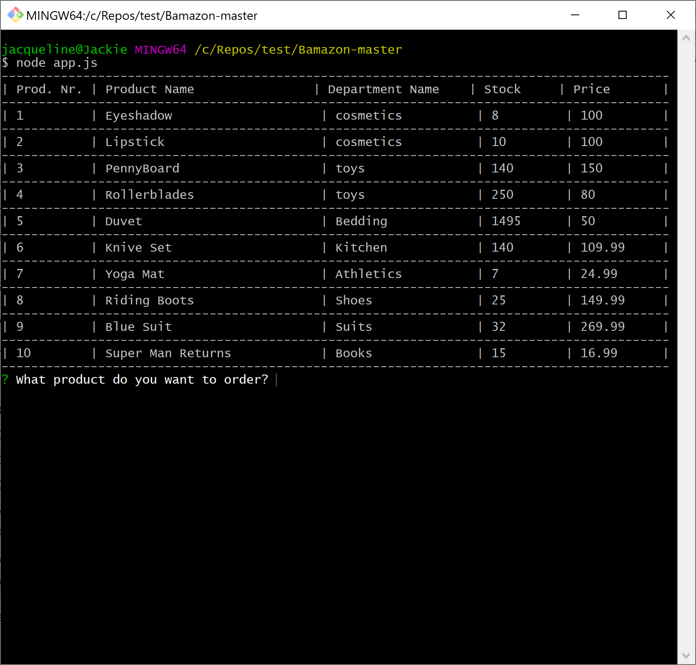
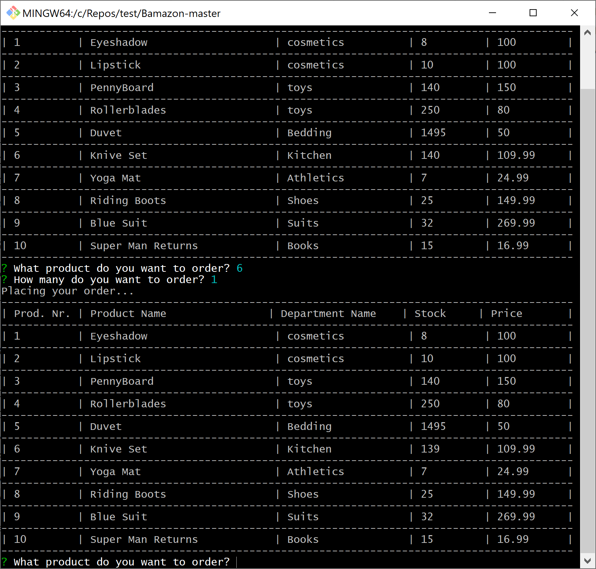
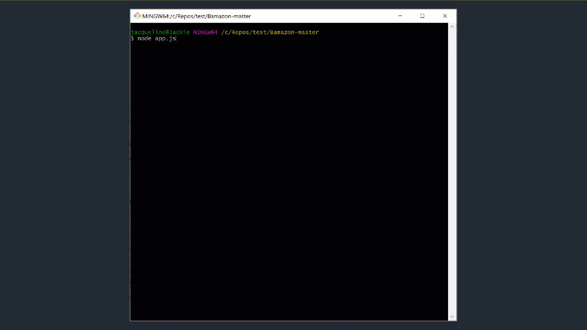

# Bamazon
Amazon-like storefront with MySQL. The app will take in orders from customers and deplete stock from the store's inventory.

## Project Tools and Technologies
This console application runs on node 12.x. The application uses MySql as a data store.

## Application Function
Bamazon is a console application that will show the user a current inventory of products. The user can order products from the available catalog of products by selecting a product ID number and indicating how many pieces of the product the users wishes to buy. The system will then deplete the inventory from the product chosen and the number of items desired. Once the order has been placed, the newly updated inventory will be displayed to the user for another round of ordering.

## Step by Step description
1. To start the application, enter 

```bash
> node app.js 
```
2. The interface will display the current inventory available in a table.

3. Select a product by entering the id number on the prompt.

4. Enter the quantity of products you would like to order.

5. The system will place the order and then show the updated inventory in a new table.


## Video of the application sequence
